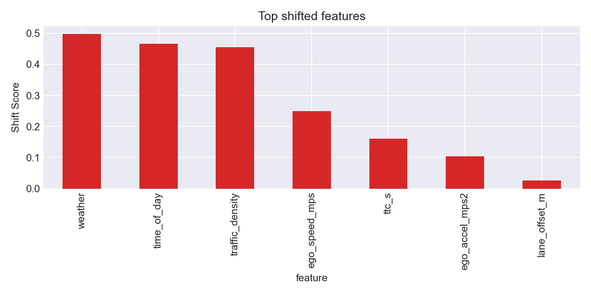
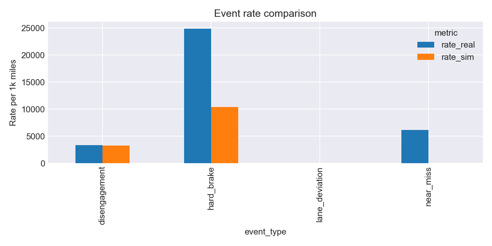
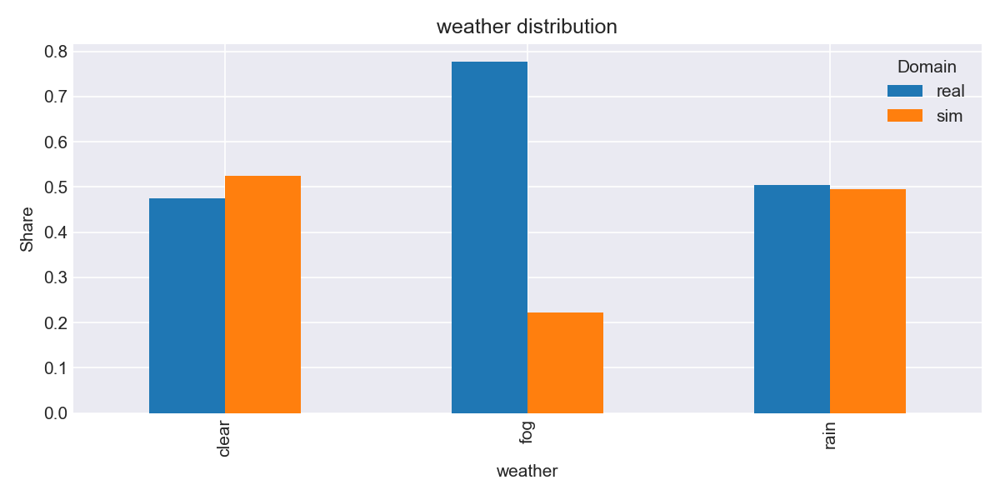

# sim2real-av-bias-audit

Simulation that disagrees with road testing is a safety risk, not an academic curiosity. `sim2real-av-bias-audit` gives AV teams a turnkey way to size the sim-to-road gap, explain the root causes, and ship artifacts that stakeholders can trust. The toolkit spans synthetic data generation, divergence measurement, domain classification, reweighting, safety event analysis, and stakeholder-ready reporting.

## Features
- Synthetic paired SIM/REAL generator with configurable shift knobs
- Schema-aware loaders for CSV and Parquet inputs
- Divergence metrics across continuous/categorical signals plus slice-level gap summaries
- Domain classifier and importance weighting to align SIM with REAL
- Safety event detection and rate comparison with uncertainty
- Plot and Markdown report generation suitable for exec and engineering stakeholders

## Results Preview




See [docs/sample_report.md](docs/sample_report.md) for a trimmed executive-ready excerpt and [docs/README_RUN.md](docs/README_RUN.md) for the exact commands that reproduce these figures.

## Quickstart
```bash
python -m venv .venv
. .venv/bin/activate  # or .venv\Scripts\activate on Windows
pip install -e .[dev]
python -m sim2real.cli generate-data --out outputs/data.parquet --trips 200 --seed 42
python -m sim2real.cli analyze --data outputs/data.parquet --outdir outputs
python -m sim2real.cli reweight --data outputs/data.parquet --out outputs/reweighted.parquet
pytest -q
```

All outputs (shift tables, slice summaries, plots, reports) are written under the chosen `--outdir`.

## What you learn from this repo
- How to measure the sim-to-real generalization gap across mixed data types with statistically backed metrics.
- How to train a domain classifier and apply importance reweighting to close divergence without retraining the sim stack.
- How to quantify uncertainty on safety event rates so you can reason about absolute risk, not just relative deltas.
- How to surface risky slices (e.g., weather, density, time of day) that move the most safety-critical KPIs.

## Bring your own SIM/REAL logs
Use the `merge-domains` helper to stitch your own simulator and road test exports into a canonical parquet before running `analyze`:
```bash
# Merge CSV samples (replace with your own file paths)
python -m sim2real.cli merge-domains --sim docs/sample_sim.csv --real docs/sample_real.csv --out outputs/merged.parquet

# Launch the full audit on the merged parquet
python -m sim2real.cli analyze --data outputs/merged.parquet --outdir outputs
```
Inputs must follow the schema defined in `sim2real/config.py` (the command automatically enforces validation and injects the correct `domain` label per file).

## Project Layout
```
sim2real-av-bias-audit/
  src/sim2real/...
  tests/
  outputs/
```

## Contributing
- Run linting/tests before submitting PRs
- Keep modules small and composable to allow swapping in dataset-specific adapters later

## Roadmap for real datasets
The architecture separates I/O (loaders) from analysis logic so adapters can be added without editing downstream code:
1. Implement a loader subclass in `sim2real/data/loaders.py` (or a thin wrapper) that maps your dataset columns to the canonical schema defined in `sim2real/config.py`.
2. Reuse `validate_frame_schema()` to enforce types/domains and extend `alias_map` to translate dataset-specific names.
3. (Optional) Write dataset-specific scripts that export Parquet files conforming to the schema so the existing CLI commands can operate unchanged.
4. Configure additional Typer commands or configs if you need custom preprocessing, but keep outputs consistent so tests and CI remain valid.

## License
MIT © Waymo Research
